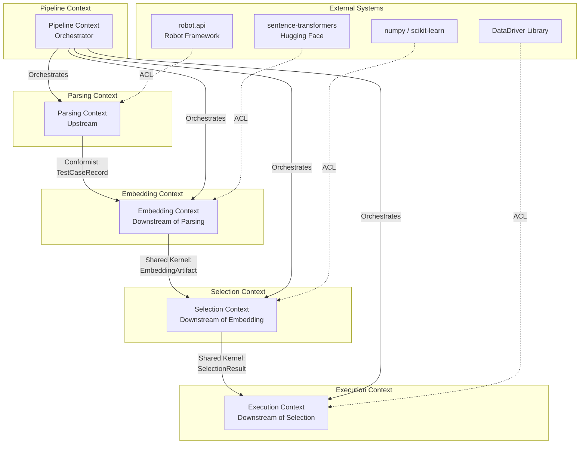
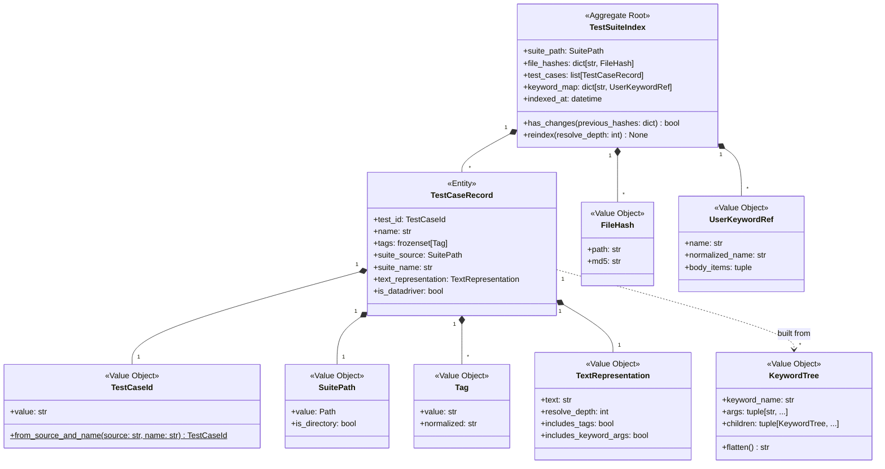
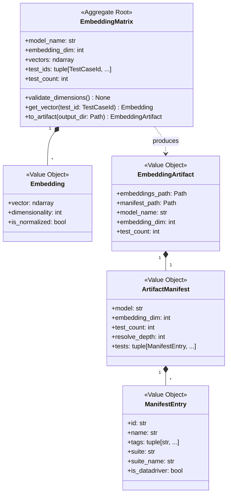
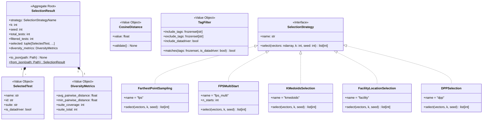
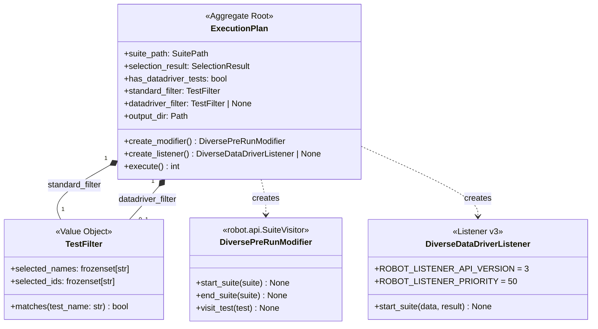
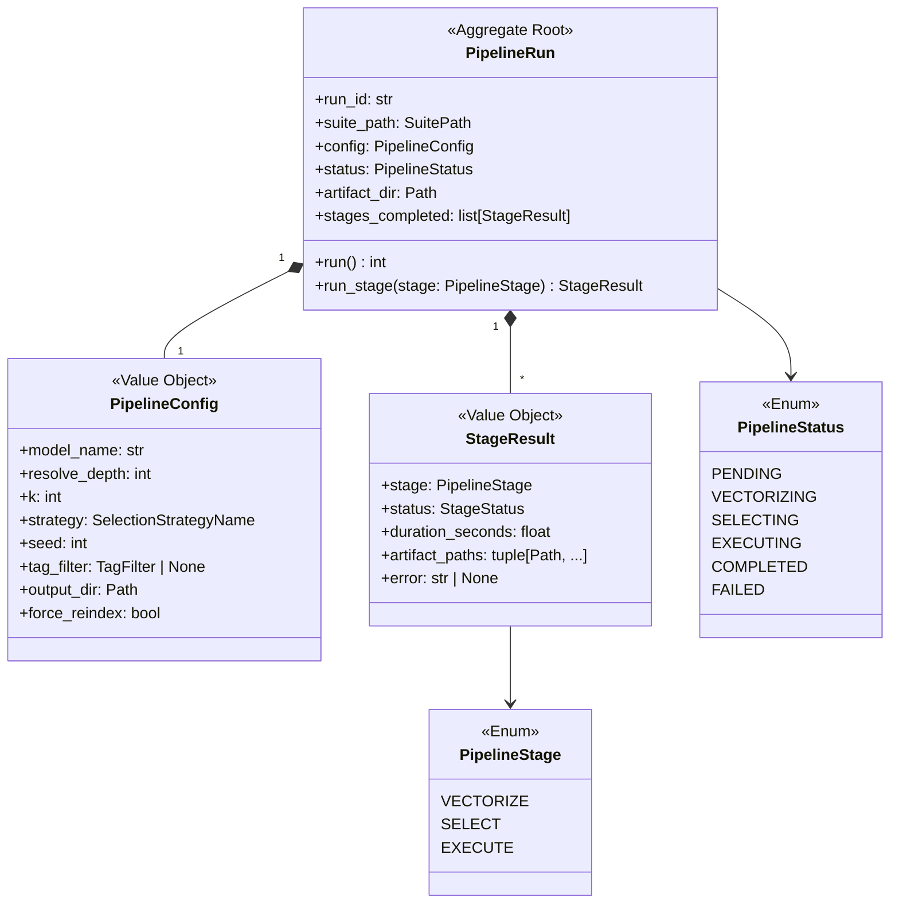
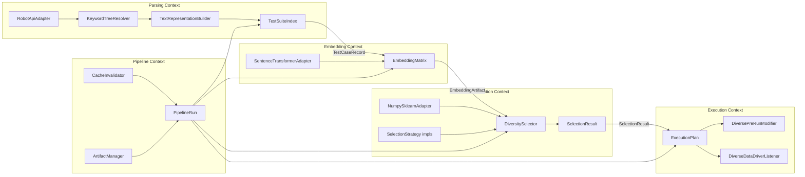

# Domain Model: Vector-Based Diverse Test Selection for Robot Framework

## Overview

This document defines the Domain-Driven Design (DDD) bounded contexts, aggregates, entities, value objects, domain events, domain services, anti-corruption layers, and context map for the Vector-Based Diverse Test Selection system. The system operates as a three-stage pipeline: **Vectorization** (parsing + embedding), **Selection** (diversity algorithms), and **Execution** (Robot Framework integration).

Design principles:
- Prefer existing `robot.api` features (`TestSuite.from_file_system`, `SuiteVisitor`, Listener v3) over new abstractions.
- Anti-corruption layers are thin wrappers that translate external types into domain types.
- Aggregates enforce invariants at their boundaries; value objects are immutable.
- Domain events decouple pipeline stages and enable caching/invalidation.

---

## Context Map



### Context Relationships

| Upstream | Downstream | Relationship | Shared Artifact |
|----------|------------|-------------|-----------------|
| Parsing | Embedding | **Conformist** -- Embedding conforms to the `TestCaseRecord` structure produced by Parsing | `TestCaseRecord` |
| Embedding | Selection | **Shared Kernel** -- Both contexts share the `EmbeddingArtifact` schema (`embeddings.npz` + `test_manifest.json`) | `EmbeddingArtifact` |
| Selection | Execution | **Shared Kernel** -- Both contexts share the `SelectionResult` schema (`selected_tests.json`) | `SelectionResult` |
| Pipeline | All | **Orchestrator** -- Pipeline context coordinates stage execution order and artifact flow | Events + Artifact paths |
| robot.api | Parsing | **ACL** -- Thin wrapper translating `robot.running.TestSuite` into domain `TestCaseRecord` | N/A |
| sentence-transformers | Embedding | **ACL** -- Wraps `SentenceTransformer.encode()` behind `EmbeddingModel` protocol | N/A |
| numpy/sklearn | Selection | **ACL** -- Wraps distance functions and array operations behind `SelectionStrategy` protocol | N/A |
| DataDriver | Execution | **ACL** -- Listener v3 priority ordering handles DataDriver-generated tests | N/A |

---

## Bounded Context 1: Parsing Context

**Responsibility:** Parse Robot Framework `.robot` files, resolve keyword trees, and produce structured `TestCaseRecord` objects suitable for embedding.

**Key constraint:** At parse time, `robot.api` provides keyword call references (name + args as strings) but does not resolve which implementation will execute. The Parsing Context resolves user keyword trees up to a configurable depth.

### Aggregate: TestSuiteIndex

The `TestSuiteIndex` is the aggregate root. It represents the fully parsed and resolved collection of test cases from a suite directory.



### Entity: TestCaseRecord

```python
from __future__ import annotations
import hashlib
from dataclasses import dataclass, field
from pathlib import Path


@dataclass(frozen=True)
class TestCaseId:
    """Stable identity for a test case, derived from source file + name."""
    value: str

    @classmethod
    def from_source_and_name(cls, source: str, name: str) -> TestCaseId:
        raw = f"{source}::{name}"
        return cls(value=hashlib.md5(raw.encode()).hexdigest())


@dataclass(frozen=True)
class Tag:
    """A Robot Framework test tag, normalized for comparison."""
    value: str

    @property
    def normalized(self) -> str:
        return self.value.lower().strip()

    def __eq__(self, other: object) -> bool:
        if isinstance(other, Tag):
            return self.normalized == other.normalized
        return NotImplemented

    def __hash__(self) -> int:
        return hash(self.normalized)


@dataclass(frozen=True)
class SuitePath:
    """Path to a .robot file or test directory."""
    value: Path

    @property
    def is_directory(self) -> bool:
        return self.value.is_dir()


@dataclass(frozen=True)
class TextRepresentation:
    """Embeddable text representation of a test case.

    Built from test name, tags, keyword names, and semantic arguments.
    Excludes DOM locators, variable placeholders, and XPaths.
    """
    text: str
    resolve_depth: int = 0
    includes_tags: bool = True
    includes_keyword_args: bool = True


@dataclass(frozen=True)
class KeywordTree:
    """Resolved keyword call tree for a single keyword invocation."""
    keyword_name: str
    args: tuple[str, ...]
    children: tuple[KeywordTree, ...] = ()

    def flatten(self) -> str:
        """Convert to natural language, filtering noise arguments."""
        kw = self.keyword_name.replace("_", " ")
        semantic_args = [
            a for a in self.args
            if not any(
                a.startswith(p)
                for p in ("id:", "css:", "xpath:", "//", "${", "@{", "%{", "&{")
            )
        ]
        text = kw
        if semantic_args:
            text += f" with {', '.join(semantic_args)}"
        children_text = " ".join(c.flatten() for c in self.children)
        return f"{text} {children_text}".strip()


@dataclass(frozen=True)
class FileHash:
    """Content hash of a .robot file for change detection."""
    path: str
    md5: str


@dataclass(frozen=True)
class TestCaseRecord:
    """Domain entity representing a parsed test case ready for embedding."""
    test_id: TestCaseId
    name: str
    tags: frozenset[Tag]
    suite_source: SuitePath
    suite_name: str
    text_representation: TextRepresentation
    is_datadriver: bool = False
```

### Domain Service: KeywordTreeResolver

Resolves keyword call references into full `KeywordTree` value objects by walking the user keyword registry.

```python
from typing import Protocol


class KeywordTreeResolver:
    """Resolves keyword names to their full sub-keyword trees.

    Wraps the manual resolution logic required because robot.api
    does not resolve keyword implementations at parse time.
    """

    def __init__(self, keyword_map: dict[str, UserKeywordRef]) -> None:
        self._kw_map = keyword_map

    def resolve(
        self,
        kw_name: str,
        kw_args: tuple[str, ...],
        max_depth: int = 10,
    ) -> KeywordTree:
        return self._resolve_recursive(kw_name, kw_args, depth=0, max_depth=max_depth)

    def _resolve_recursive(
        self, kw_name: str, kw_args: tuple[str, ...], depth: int, max_depth: int
    ) -> KeywordTree:
        children: list[KeywordTree] = []
        if depth < max_depth:
            normalized = kw_name.lower().replace(" ", "_")
            uk = self._kw_map.get(normalized)
            if uk is not None:
                for item in uk.body_items:
                    if hasattr(item, "name") and item.name:
                        child = self._resolve_recursive(
                            item.name, tuple(item.args), depth + 1, max_depth
                        )
                        children.append(child)
        return KeywordTree(
            keyword_name=kw_name,
            args=kw_args,
            children=tuple(children),
        )
```

### Domain Service: TextRepresentationBuilder

Converts a parsed test case (with resolved keyword trees) into a `TextRepresentation` value object.

```python
class TextRepresentationBuilder:
    """Builds embeddable text from a test case and its keyword tree.

    Includes test name, tags, keyword names, and semantic arguments.
    Filters DOM locators, variable placeholders, and XPaths -- these
    are noise that dilutes embedding quality (19-27% improvement
    when excluded per research findings).
    """

    def __init__(self, resolver: KeywordTreeResolver, resolve_depth: int = 0) -> None:
        self._resolver = resolver
        self._resolve_depth = resolve_depth

    def build(self, test_name: str, tags: frozenset[Tag], body_items: list) -> TextRepresentation:
        parts = [f"Test: {test_name}."]
        if tags:
            parts.append(f"Tags: {', '.join(t.value for t in sorted(tags, key=lambda t: t.normalized))}.")
        for item in body_items:
            if hasattr(item, "name") and item.name:
                if self._resolve_depth > 0:
                    tree = self._resolver.resolve(
                        item.name, tuple(item.args), max_depth=self._resolve_depth
                    )
                    parts.append(tree.flatten())
                else:
                    kw_text = item.name.replace("_", " ")
                    semantic_args = [
                        str(a) for a in item.args
                        if not any(str(a).startswith(p) for p in ("id:", "css:", "xpath:", "//", "${"))
                    ]
                    if semantic_args:
                        kw_text += f" with {', '.join(semantic_args)}"
                    parts.append(kw_text)
        return TextRepresentation(
            text=" ".join(parts),
            resolve_depth=self._resolve_depth,
        )
```

### Anti-Corruption Layer: RobotApiAdapter

Wraps `robot.api` types and translates them into domain objects. This is the only place where `robot.api` types are imported.

```python
from pathlib import Path
from robot.api import TestSuite as RobotTestSuite


@dataclass(frozen=True)
class UserKeywordRef:
    """Domain representation of a user keyword from robot.api."""
    name: str
    normalized_name: str
    body_items: tuple


class RobotApiAdapter:
    """ACL: Translates robot.api types into domain objects.

    Uses TestSuite.from_file_system() as the primary entry point,
    which is the recommended robot.api approach for building a
    complete suite model from .robot files or directories.
    """

    def parse_suite(self, suite_path: Path) -> tuple[list, dict[str, UserKeywordRef]]:
        """Parse a suite directory and return (raw_tests, keyword_map).

        Returns raw robot.api test objects and a domain keyword map.
        Callers use TextRepresentationBuilder to convert to TestCaseRecords.
        """
        robot_suite = RobotTestSuite.from_file_system(str(suite_path))
        kw_map = self._build_keyword_map(robot_suite)
        raw_tests = self._collect_tests(robot_suite)
        return raw_tests, kw_map

    def _build_keyword_map(self, suite: RobotTestSuite) -> dict[str, UserKeywordRef]:
        kw_map: dict[str, UserKeywordRef] = {}
        if hasattr(suite, "resource") and suite.resource:
            for uk in suite.resource.keywords:
                ref = UserKeywordRef(
                    name=uk.name,
                    normalized_name=uk.name.lower().replace(" ", "_"),
                    body_items=tuple(uk.body),
                )
                kw_map[ref.normalized_name] = ref
        for child in suite.suites:
            kw_map.update(self._build_keyword_map(child))
        return kw_map

    def _collect_tests(self, suite: RobotTestSuite) -> list[dict]:
        """Collect raw test data from suite hierarchy."""
        tests = []
        for test in suite.tests:
            tests.append({
                "name": test.name,
                "tags": [str(t) for t in test.tags],
                "body": list(test.body),
                "source": str(suite.source) if suite.source else suite.name,
                "suite_name": suite.name,
            })
        for child in suite.suites:
            tests.extend(self._collect_tests(child))
        return tests

    def compute_file_hashes(self, suite_path: Path) -> dict[str, FileHash]:
        """Hash all .robot files for change detection."""
        import hashlib as _hashlib
        hashes = {}
        for p in suite_path.rglob("*.robot"):
            md5 = _hashlib.md5(p.read_bytes()).hexdigest()
            hashes[str(p)] = FileHash(path=str(p), md5=md5)
        return hashes
```

### Domain Event: TestSuiteIndexed

```python
@dataclass(frozen=True)
class TestSuiteIndexed:
    """Raised when parsing completes and TestCaseRecords are available."""
    suite_path: SuitePath
    test_count: int
    file_hashes: dict[str, FileHash]
    test_ids: tuple[TestCaseId, ...]
    timestamp: datetime
```

---

## Bounded Context 2: Embedding Context

**Responsibility:** Accept `TestCaseRecord` objects, compute vector embeddings via a transformer model, and produce a portable `EmbeddingArtifact`.

### Aggregate: EmbeddingMatrix

The `EmbeddingMatrix` is the aggregate root. It holds all embeddings for a test suite and enforces the invariant that every `TestCaseRecord` has exactly one embedding vector of the correct dimensionality.



### Value Objects

```python
import numpy as np
from numpy.typing import NDArray


@dataclass(frozen=True)
class Embedding:
    """A single test case embedding vector."""
    vector: NDArray[np.float32]

    @property
    def dimensionality(self) -> int:
        return self.vector.shape[0]

    @property
    def is_normalized(self) -> bool:
        norm = float(np.linalg.norm(self.vector))
        return abs(norm - 1.0) < 1e-6


@dataclass(frozen=True)
class ManifestEntry:
    """Metadata for a single test in the artifact manifest."""
    id: str
    name: str
    tags: tuple[str, ...]
    suite: str
    suite_name: str
    is_datadriver: bool


@dataclass(frozen=True)
class ArtifactManifest:
    """Describes the contents of an EmbeddingArtifact."""
    model: str
    embedding_dim: int
    test_count: int
    resolve_depth: int
    tests: tuple[ManifestEntry, ...]


@dataclass(frozen=True)
class EmbeddingArtifact:
    """Portable artifact produced by the Embedding Context.

    Consists of two files:
    - embeddings.npz: numpy archive with 'vectors' (N x dim) and 'ids' (N,)
    - test_manifest.json: human-readable metadata
    """
    embeddings_path: Path
    manifest_path: Path
    model_name: str
    embedding_dim: int
    test_count: int
```

### Aggregate Root: EmbeddingMatrix

```python
class EmbeddingMatrix:
    """Aggregate root: holds all embeddings for a test suite.

    Invariants:
    - vectors.shape[0] == len(test_ids)  (one vector per test)
    - vectors.shape[1] == embedding_dim  (consistent dimensionality)
    - All vectors are L2-normalized for cosine distance computation
    """

    def __init__(
        self,
        model_name: str,
        embedding_dim: int,
        vectors: NDArray[np.float32],
        test_ids: tuple[TestCaseId, ...],
    ) -> None:
        self.model_name = model_name
        self.embedding_dim = embedding_dim
        self.vectors = vectors
        self.test_ids = test_ids
        self.validate_dimensions()

    @property
    def test_count(self) -> int:
        return len(self.test_ids)

    def validate_dimensions(self) -> None:
        if self.vectors.shape[0] != len(self.test_ids):
            raise ValueError(
                f"Vector count {self.vectors.shape[0]} != "
                f"test ID count {len(self.test_ids)}"
            )
        if self.vectors.shape[1] != self.embedding_dim:
            raise ValueError(
                f"Vector dim {self.vectors.shape[1]} != "
                f"expected dim {self.embedding_dim}"
            )

    def get_vector(self, test_id: TestCaseId) -> Embedding:
        idx = self.test_ids.index(test_id)
        return Embedding(vector=self.vectors[idx])

    def to_artifact(
        self,
        output_dir: Path,
        manifest_entries: tuple[ManifestEntry, ...],
        resolve_depth: int = 0,
    ) -> EmbeddingArtifact:
        """Serialize to portable artifact files."""
        output_dir.mkdir(parents=True, exist_ok=True)
        emb_path = output_dir / "embeddings.npz"
        manifest_path = output_dir / "test_manifest.json"

        np.savez_compressed(
            emb_path,
            vectors=self.vectors,
            ids=np.array([tid.value for tid in self.test_ids]),
        )

        manifest = ArtifactManifest(
            model=self.model_name,
            embedding_dim=self.embedding_dim,
            test_count=self.test_count,
            resolve_depth=resolve_depth,
            tests=manifest_entries,
        )
        import json
        manifest_path.write_text(json.dumps({
            "model": manifest.model,
            "embedding_dim": manifest.embedding_dim,
            "test_count": manifest.test_count,
            "resolve_depth": manifest.resolve_depth,
            "tests": [
                {
                    "id": e.id, "name": e.name, "tags": list(e.tags),
                    "suite": e.suite, "suite_name": e.suite_name,
                    "is_datadriver": e.is_datadriver,
                }
                for e in manifest.tests
            ],
        }, indent=2))

        return EmbeddingArtifact(
            embeddings_path=emb_path,
            manifest_path=manifest_path,
            model_name=self.model_name,
            embedding_dim=self.embedding_dim,
            test_count=self.test_count,
        )
```

### Anti-Corruption Layer: SentenceTransformerAdapter

```python
from typing import Protocol


class EmbeddingModel(Protocol):
    """Protocol for embedding models. Decouples domain from sentence-transformers."""

    @property
    def embedding_dim(self) -> int: ...

    def encode(self, texts: list[str]) -> NDArray[np.float32]: ...


class SentenceTransformerAdapter:
    """ACL: Wraps sentence-transformers behind the EmbeddingModel protocol.

    Default model: all-MiniLM-L6-v2 (22M params, 384 dims, CPU-friendly).
    Alternative: all-mpnet-base-v2 (768 dims) for higher quality.
    """

    def __init__(self, model_name: str = "all-MiniLM-L6-v2") -> None:
        from sentence_transformers import SentenceTransformer
        self._model = SentenceTransformer(model_name)
        self._model_name = model_name

    @property
    def model_name(self) -> str:
        return self._model_name

    @property
    def embedding_dim(self) -> int:
        return self._model.get_sentence_embedding_dimension()

    def encode(self, texts: list[str]) -> NDArray[np.float32]:
        return self._model.encode(
            texts,
            show_progress_bar=True,
            normalize_embeddings=True,
        )
```

### Domain Event: EmbeddingsComputed

```python
@dataclass(frozen=True)
class EmbeddingsComputed:
    """Raised when embedding computation completes."""
    artifact: EmbeddingArtifact
    test_count: int
    model_name: str
    timestamp: datetime
```

---

## Bounded Context 3: Selection Context

**Responsibility:** Load embedding artifacts, apply optional tag filters, run a diversity selection algorithm, and produce a `SelectionResult`.

### Aggregate: SelectionResult



### Value Objects

```python
@dataclass(frozen=True)
class CosineDistance:
    """Cosine distance between two embedding vectors. Range: [0, 2]."""
    value: float

    def __post_init__(self) -> None:
        if not (0.0 <= self.value <= 2.0 + 1e-6):
            raise ValueError(f"Cosine distance must be in [0, 2], got {self.value}")


@dataclass(frozen=True)
class DiversityMetrics:
    """Statistics describing the diversity of a selected test subset."""
    avg_pairwise_distance: float
    min_pairwise_distance: float
    suite_coverage: int
    suite_total: int

    @property
    def suite_coverage_ratio(self) -> float:
        if self.suite_total == 0:
            return 0.0
        return self.suite_coverage / self.suite_total


@dataclass(frozen=True)
class SelectedTest:
    """A test case that was selected by the diversity algorithm."""
    name: str
    id: str
    suite: str
    is_datadriver: bool


@dataclass(frozen=True)
class TagFilter:
    """Pre-filter criteria applied before diversity selection."""
    include_tags: frozenset[str] = frozenset()
    exclude_tags: frozenset[str] = frozenset()
    include_datadriver: bool = True

    def matches(self, tags: frozenset[str], is_datadriver: bool) -> bool:
        if not self.include_datadriver and is_datadriver:
            return False
        normalized_tags = frozenset(t.lower() for t in tags)
        if self.include_tags and not (normalized_tags & self.include_tags):
            return False
        if self.exclude_tags and (normalized_tags & self.exclude_tags):
            return False
        return True


SelectionStrategyName = str  # "fps" | "fps_multi" | "kmedoids" | "facility" | "dpp"
```

### Strategy Interface and Implementations

```python
from typing import Protocol, runtime_checkable


@runtime_checkable
class SelectionStrategy(Protocol):
    """Protocol for diversity selection algorithms.

    All implementations take a (N, d) embedding matrix and return
    k indices into that matrix.
    """

    @property
    def name(self) -> str: ...

    def select(
        self, vectors: NDArray[np.float32], k: int, seed: int = 42
    ) -> list[int]: ...


class FarthestPointSampling:
    """Greedy farthest-first traversal for maximum dispersion.

    2-approximation guarantee for max-min dispersion (Gonzalez, 1985).
    Time: O(N * k * d). Deterministic given seed.
    """

    name = "fps"

    def select(
        self, vectors: NDArray[np.float32], k: int, seed: int = 42
    ) -> list[int]:
        from sklearn.metrics.pairwise import cosine_distances

        N = vectors.shape[0]
        rng = np.random.RandomState(seed)
        initial = rng.randint(N)
        selected = [initial]
        min_distances = cosine_distances(vectors[initial : initial + 1], vectors)[0]
        min_distances[initial] = -np.inf
        for _ in range(k - 1):
            next_idx = int(np.argmax(min_distances))
            selected.append(next_idx)
            new_dists = cosine_distances(vectors[next_idx : next_idx + 1], vectors)[0]
            min_distances = np.minimum(min_distances, new_dists)
            min_distances[next_idx] = -np.inf
        return selected


class FPSMultiStart:
    """FPS from multiple starting points, keeps best result.

    'Best' = maximizes minimum pairwise distance in selected set.
    Mitigates initial-point sensitivity.
    """

    name = "fps_multi"

    def __init__(self, n_starts: int = 5) -> None:
        self._n_starts = n_starts

    def select(
        self, vectors: NDArray[np.float32], k: int, seed: int = 42
    ) -> list[int]:
        from sklearn.metrics.pairwise import cosine_distances

        fps = FarthestPointSampling()
        best_selected: list[int] | None = None
        best_min_dist = -1.0
        for i in range(self._n_starts):
            selected = fps.select(vectors, k, seed=seed + i)
            sel_vectors = vectors[selected]
            pairwise = cosine_distances(sel_vectors, sel_vectors)
            np.fill_diagonal(pairwise, np.inf)
            min_dist = float(pairwise.min())
            if min_dist > best_min_dist:
                best_min_dist = min_dist
                best_selected = selected
        return best_selected  # type: ignore[return-value]


class KMedoidsSelection:
    """Cluster representatives via k-medoids (PAM algorithm).

    Optimizes representativeness, not dispersion.
    Each medoid is a real data point.
    """

    name = "kmedoids"

    def select(
        self, vectors: NDArray[np.float32], k: int, seed: int = 42
    ) -> list[int]:
        from sklearn_extra.cluster import KMedoids

        kmed = KMedoids(
            n_clusters=k, metric="cosine", method="pam",
            init="k-medoids++", random_state=seed, max_iter=300,
        )
        kmed.fit(vectors)
        return list(kmed.medoid_indices_)


class FacilityLocationSelection:
    """Submodular facility location for representative selection.

    (1-1/e) ~ 0.632 approximation guarantee.
    Ensures no cluster goes unrepresented.
    """

    name = "facility"

    def select(
        self, vectors: NDArray[np.float32], k: int, seed: int = 42
    ) -> list[int]:
        from apricot import FacilityLocationSelection as ApricotFL

        selector = ApricotFL(k, metric="cosine", verbose=False)
        selector.fit(vectors)
        return list(selector.ranking)


class DPPSelection:
    """Determinantal Point Process for probabilistic diverse sampling.

    Produces genuinely random diverse subsets.
    Useful for nightly CI runs that collectively cover more ground.
    """

    name = "dpp"

    def select(
        self, vectors: NDArray[np.float32], k: int, seed: int = 42
    ) -> list[int]:
        from dppy.finite_dpps import FiniteDPP
        from sklearn.preprocessing import normalize

        np.random.seed(seed)
        X_norm = normalize(vectors, norm="l2")
        L = X_norm @ X_norm.T
        L = (L + L.T) / 2
        dpp = FiniteDPP("likelihood", **{"L": L})
        dpp.sample_exact_k_dpp(size=k)
        return list(dpp.list_of_samples[-1])
```

### Domain Service: DiversitySelector

Orchestrates tag filtering, strategy execution, and metric computation.

```python
class DiversitySelector:
    """Domain service that applies filtering and selection.

    Loads EmbeddingArtifact, applies TagFilter, runs a
    SelectionStrategy, computes DiversityMetrics, and
    produces a SelectionResult.
    """

    def __init__(self, strategy: SelectionStrategy) -> None:
        self._strategy = strategy

    def select(
        self,
        vectors: NDArray[np.float32],
        manifest_entries: tuple[ManifestEntry, ...],
        k: int,
        tag_filter: TagFilter | None = None,
        seed: int = 42,
    ) -> SelectionResult:
        from sklearn.metrics.pairwise import cosine_distances

        # Apply tag filter
        if tag_filter is not None:
            valid = [
                i for i, entry in enumerate(manifest_entries)
                if tag_filter.matches(
                    frozenset(entry.tags), entry.is_datadriver
                )
            ]
        else:
            valid = list(range(len(manifest_entries)))

        filtered_vectors = vectors[valid]
        filtered_entries = tuple(manifest_entries[i] for i in valid)
        k = min(k, len(filtered_entries))

        # Run selection
        if k >= len(filtered_entries):
            selected_indices = list(range(len(filtered_entries)))
        else:
            selected_indices = self._strategy.select(filtered_vectors, k, seed)

        selected_tests = tuple(
            SelectedTest(
                name=filtered_entries[i].name,
                id=filtered_entries[i].id,
                suite=filtered_entries[i].suite,
                is_datadriver=filtered_entries[i].is_datadriver,
            )
            for i in selected_indices
        )

        # Compute diversity metrics
        sel_vectors = filtered_vectors[selected_indices]
        pairwise = cosine_distances(sel_vectors, sel_vectors)
        np.fill_diagonal(pairwise, np.nan)
        suites_selected = len(set(t.suite for t in selected_tests))
        suites_total = len(set(e.suite for e in filtered_entries))

        metrics = DiversityMetrics(
            avg_pairwise_distance=float(np.nanmean(pairwise)),
            min_pairwise_distance=float(np.nanmin(pairwise)),
            suite_coverage=suites_selected,
            suite_total=suites_total,
        )

        return SelectionResult(
            strategy=self._strategy.name,
            k=k,
            seed=seed,
            total_tests=len(manifest_entries),
            filtered_tests=len(filtered_entries),
            selected=selected_tests,
            diversity_metrics=metrics,
        )
```

### Aggregate Root: SelectionResult

```python
import json


@dataclass(frozen=True)
class SelectionResult:
    """Aggregate root: the output of the selection pipeline stage."""
    strategy: SelectionStrategyName
    k: int
    seed: int
    total_tests: int
    filtered_tests: int
    selected: tuple[SelectedTest, ...]
    diversity_metrics: DiversityMetrics

    def to_json(self, path: Path) -> None:
        data = {
            "strategy": self.strategy,
            "k": self.k,
            "total_tests": self.total_tests,
            "filtered_tests": self.filtered_tests,
            "seed": self.seed,
            "selected": [
                {
                    "name": t.name,
                    "id": t.id,
                    "suite": t.suite,
                    "is_datadriver": t.is_datadriver,
                }
                for t in self.selected
            ],
        }
        path.write_text(json.dumps(data, indent=2))

    @classmethod
    def from_json(cls, path: Path) -> SelectionResult:
        data = json.loads(path.read_text())
        selected = tuple(
            SelectedTest(
                name=t["name"],
                id=t["id"],
                suite=t.get("suite", ""),
                is_datadriver=t.get("is_datadriver", False),
            )
            for t in data["selected"]
        )
        return cls(
            strategy=data["strategy"],
            k=data["k"],
            seed=data.get("seed", 42),
            total_tests=data["total_tests"],
            filtered_tests=data.get("filtered_tests", data["total_tests"]),
            selected=selected,
            diversity_metrics=DiversityMetrics(
                avg_pairwise_distance=0.0,
                min_pairwise_distance=0.0,
                suite_coverage=0,
                suite_total=0,
            ),
        )
```

### Anti-Corruption Layer: NumpySklearnAdapter

```python
class NumpySklearnAdapter:
    """ACL: Wraps numpy/sklearn operations behind domain interfaces.

    Provides cosine distance computation and array loading without
    leaking numpy/sklearn types into the domain model.
    """

    @staticmethod
    def load_vectors(npz_path: Path) -> tuple[NDArray[np.float32], list[str]]:
        data = np.load(npz_path, allow_pickle=True)
        return data["vectors"], list(data["ids"])

    @staticmethod
    def cosine_distance_matrix(vectors: NDArray[np.float32]) -> NDArray[np.float32]:
        from sklearn.metrics.pairwise import cosine_distances
        return cosine_distances(vectors, vectors)
```

### Domain Event: SelectionCompleted

```python
@dataclass(frozen=True)
class SelectionCompleted:
    """Raised when diversity selection finishes."""
    strategy: SelectionStrategyName
    k: int
    total_tests: int
    filtered_tests: int
    diversity_metrics: DiversityMetrics
    output_path: Path
    timestamp: datetime
```

---

## Bounded Context 4: Execution Context

**Responsibility:** Receive a `SelectionResult` and integrate with Robot Framework's execution pipeline to run only the selected tests. Handles both standard suites (via `PreRunModifier` / `SuiteVisitor`) and DataDriver-generated suites (via Listener v3).

### Aggregate: ExecutionPlan



### Value Object: TestFilter

```python
@dataclass(frozen=True)
class TestFilter:
    """Immutable set of test names/IDs used to filter execution.

    Used by both PreRunModifier and Listener v3.
    """
    selected_names: frozenset[str]
    selected_ids: frozenset[str]

    def matches(self, test_name: str) -> bool:
        return test_name in self.selected_names

    @classmethod
    def from_selection_result(
        cls, result: SelectionResult, datadriver_only: bool = False
    ) -> TestFilter:
        tests = [
            t for t in result.selected
            if t.is_datadriver == datadriver_only
        ]
        return cls(
            selected_names=frozenset(t.name for t in tests),
            selected_ids=frozenset(t.id for t in tests),
        )
```

### Robot Framework Integration: PreRunModifier

Uses `robot.api.SuiteVisitor` -- the standard Robot Framework mechanism for modifying the suite model before execution. Runs after parsing but before execution and before tag filtering.

```python
from robot.api import SuiteVisitor


class DiversePreRunModifier(SuiteVisitor):
    """PreRunModifier that filters standard (non-DataDriver) tests.

    Command-line:
        robot --prerunmodifier module:DiversePreRunModifier:selected_tests.json tests/

    Programmatic:
        suite = TestSuite.from_file_system('tests/')
        suite.visit(DiversePreRunModifier('selected_tests.json'))
        suite.run(output='output.xml')
    """

    def __init__(self, selection_file: str) -> None:
        result = SelectionResult.from_json(Path(selection_file))
        self._filter = TestFilter.from_selection_result(result, datadriver_only=False)

    def start_suite(self, suite) -> None:
        suite.tests = [t for t in suite.tests if self._filter.matches(t.name)]

    def end_suite(self, suite) -> None:
        suite.suites = [s for s in suite.suites if s.test_count > 0]

    def visit_test(self, test) -> None:
        pass  # skip visiting test internals for performance
```

### Robot Framework Integration: Listener v3 for DataDriver

DataDriver generates tests via its own `start_suite` listener event, which fires **after** PreRunModifiers. This listener must run after DataDriver (lower `ROBOT_LISTENER_PRIORITY`).

**Execution order:**
1. Robot Framework parses `.robot` files -> builds TestSuite model
2. PreRunModifiers run -> only template test exists for DataDriver suites
3. Tag filtering (`--include`/`--exclude`) is processed
4. Execution begins -> Listener v3 `start_suite` fires
5. DataDriver's `start_suite` fires -> generates tests from CSV/Excel
6. **Our listener's `start_suite` fires -> filters generated tests**

```python
class DiverseDataDriverListener:
    """Listener v3 that filters DataDriver-generated tests.

    Must run AFTER DataDriver generates its tests. DataDriver uses
    default listener priority; setting ours lower ensures we run after.

    Command-line:
        robot --listener module:DiverseDataDriverListener:selected_tests.json tests/
    """
    ROBOT_LISTENER_API_VERSION = 3
    ROBOT_LISTENER_PRIORITY = 50  # lower than default -> runs after DataDriver

    def __init__(self, selection_file: str) -> None:
        result = SelectionResult.from_json(Path(selection_file))
        self._filter = TestFilter.from_selection_result(result, datadriver_only=True)
        self._has_dd_tests = bool(self._filter.selected_names)

    def start_suite(self, data, result) -> None:
        if not self._has_dd_tests:
            return
        if len(data.tests) <= 1:
            return  # not a DataDriver suite
        original_count = len(data.tests)
        matches = [t for t in data.tests if self._filter.matches(t.name)]
        if matches:
            data.tests = matches
```

### Aggregate Root: ExecutionPlan

```python
class ExecutionPlan:
    """Aggregate root: coordinates execution of selected tests.

    Determines whether DataDriver integration is needed and creates
    the appropriate Robot Framework integration objects.
    """

    def __init__(
        self,
        suite_path: SuitePath,
        selection_result: SelectionResult,
        output_dir: Path,
    ) -> None:
        self.suite_path = suite_path
        self.selection_result = selection_result
        self.output_dir = output_dir
        self.standard_filter = TestFilter.from_selection_result(
            selection_result, datadriver_only=False
        )
        self.has_datadriver_tests = any(
            t.is_datadriver for t in selection_result.selected
        )
        self.datadriver_filter: TestFilter | None = None
        if self.has_datadriver_tests:
            self.datadriver_filter = TestFilter.from_selection_result(
                selection_result, datadriver_only=True
            )

    def execute(self, extra_args: dict | None = None) -> int:
        """Run Robot Framework with the appropriate filters applied."""
        from robot.api import TestSuite as RobotTestSuite
        import robot

        self.output_dir.mkdir(parents=True, exist_ok=True)

        args = [
            "--outputdir", str(self.output_dir),
            "--prerunmodifier",
            f"{__name__}.DiversePreRunModifier:{self._selection_path}",
        ]
        if self.has_datadriver_tests:
            args.extend([
                "--listener",
                f"{__name__}.DiverseDataDriverListener:{self._selection_path}",
            ])
        if extra_args:
            for key, val in extra_args.items():
                args.extend([f"--{key}", str(val)])
        args.append(str(self.suite_path.value))

        return robot.run_cli(args, exit=False)
```

### Domain Event: ExecutionPlanCreated

```python
@dataclass(frozen=True)
class ExecutionPlanCreated:
    """Raised when an execution plan is assembled from a selection result."""
    suite_path: SuitePath
    selected_count: int
    has_datadriver: bool
    strategy: SelectionStrategyName
    timestamp: datetime
```

### Domain Event: TestsFiltered

```python
@dataclass(frozen=True)
class TestsFiltered:
    """Raised when PreRunModifier or Listener applies test filtering."""
    suite_name: str
    original_count: int
    filtered_count: int
    is_datadriver_suite: bool
    timestamp: datetime
```

---

## Bounded Context 5: Pipeline Context

**Responsibility:** Orchestrate the three pipeline stages, manage artifact flow between stages, handle caching/invalidation, and coordinate error handling.

### Aggregate: PipelineRun



### Value Objects

```python
from enum import Enum


class PipelineStage(Enum):
    VECTORIZE = "vectorize"
    SELECT = "select"
    EXECUTE = "execute"


class PipelineStatus(Enum):
    PENDING = "pending"
    VECTORIZING = "vectorizing"
    SELECTING = "selecting"
    EXECUTING = "executing"
    COMPLETED = "completed"
    FAILED = "failed"


class StageStatus(Enum):
    SUCCESS = "success"
    SKIPPED = "skipped"
    FAILED = "failed"


@dataclass(frozen=True)
class PipelineConfig:
    """Configuration for a complete pipeline run."""
    model_name: str = "all-MiniLM-L6-v2"
    resolve_depth: int = 0
    k: int = 50
    strategy: SelectionStrategyName = "fps"
    seed: int = 42
    tag_filter: TagFilter | None = None
    output_dir: Path = Path("./results")
    force_reindex: bool = False


@dataclass(frozen=True)
class StageResult:
    """Outcome of a single pipeline stage execution."""
    stage: PipelineStage
    status: StageStatus
    duration_seconds: float
    artifact_paths: tuple[Path, ...]
    error: str | None = None
```

### Domain Service: CacheInvalidator

Determines whether vectorization can be skipped based on file content hashes.

```python
class CacheInvalidator:
    """Detects whether .robot file content has changed since last indexing.

    Compares MD5 hashes of all .robot files against stored hashes.
    Also tracks DataDriver CSV files if configured.
    """

    def __init__(self, hash_store_path: Path) -> None:
        self._hash_store_path = hash_store_path

    def has_changes(self, suite_path: Path) -> bool:
        current = self._compute_hashes(suite_path)
        if not self._hash_store_path.exists():
            return True
        previous = json.loads(self._hash_store_path.read_text())
        return current != previous

    def save_hashes(self, suite_path: Path) -> None:
        current = self._compute_hashes(suite_path)
        self._hash_store_path.write_text(json.dumps(current))

    @staticmethod
    def _compute_hashes(suite_path: Path) -> dict[str, str]:
        import hashlib as _hashlib
        hashes: dict[str, str] = {}
        for ext in ("*.robot", "*.csv"):
            for p in suite_path.rglob(ext):
                hashes[str(p)] = _hashlib.md5(p.read_bytes()).hexdigest()
        return hashes
```

### Domain Service: ArtifactManager

Manages reading and writing of inter-stage artifacts.

```python
class ArtifactManager:
    """Manages artifact lifecycle between pipeline stages.

    Artifacts:
    - Stage 1 -> Stage 2: embeddings.npz + test_manifest.json
    - Stage 2 -> Stage 3: selected_tests.json
    - Stage 3 output: output.xml, log.html, report.html, selection_report.json
    """

    def __init__(self, artifact_dir: Path) -> None:
        self._dir = artifact_dir
        self._dir.mkdir(parents=True, exist_ok=True)

    @property
    def embeddings_path(self) -> Path:
        return self._dir / "embeddings.npz"

    @property
    def manifest_path(self) -> Path:
        return self._dir / "test_manifest.json"

    @property
    def selection_path(self) -> Path:
        return self._dir / "selected_tests.json"

    @property
    def hash_store_path(self) -> Path:
        return self._dir / "file_hashes.json"

    def has_embedding_artifacts(self) -> bool:
        return self.embeddings_path.exists() and self.manifest_path.exists()

    def has_selection_artifact(self) -> bool:
        return self.selection_path.exists()

    def load_manifest(self) -> ArtifactManifest:
        data = json.loads(self.manifest_path.read_text())
        return ArtifactManifest(
            model=data["model"],
            embedding_dim=data["embedding_dim"],
            test_count=data["test_count"],
            resolve_depth=data.get("resolve_depth", 0),
            tests=tuple(
                ManifestEntry(
                    id=t["id"], name=t["name"],
                    tags=tuple(t.get("tags", [])),
                    suite=t.get("suite", ""),
                    suite_name=t.get("suite_name", ""),
                    is_datadriver=t.get("is_datadriver", False),
                )
                for t in data["tests"]
            ),
        )

    def load_vectors(self) -> NDArray[np.float32]:
        data = np.load(self.embeddings_path, allow_pickle=True)
        return data["vectors"]
```

---

## Domain Events Summary

All domain events are immutable dataclasses. They decouple pipeline stages and enable observability.

| Event | Producer | Consumer(s) | Trigger |
|-------|----------|-------------|---------|
| `TestSuiteIndexed` | Parsing Context | Embedding Context, Pipeline Context | `.robot` files parsed successfully |
| `EmbeddingsComputed` | Embedding Context | Selection Context, Pipeline Context | Vectors computed and artifacts written |
| `SelectionCompleted` | Selection Context | Execution Context, Pipeline Context | Diversity algorithm finished |
| `ExecutionPlanCreated` | Execution Context | Pipeline Context | Execution plan assembled |
| `TestsFiltered` | Execution Context | Pipeline Context (logging) | PreRunModifier or Listener applied filtering |

---

## Strategy Selection Guide

The Selection Context supports five strategies. Choice depends on the CI scenario:

| Scenario | Strategy | k | Rationale |
|----------|----------|---|-----------|
| Daily CI on main | `fps` | 20% of N | Fast, deterministic, good boundary coverage |
| PR validation | `fps_multi` | 15% of N | Multi-start mitigates initial-point sensitivity |
| Nightly diversity | `dpp` | 30% of N | Random diverse sample, varies nightly for cumulative coverage |
| Pre-release regression | `facility` | 50% of N | Ensures every test cluster is represented |
| Quick smoke test | `fps` | 10 (absolute) | 10 most different tests |

---

## Technology Decisions

| Concern | Choice | Rationale |
|---------|--------|-----------|
| Embedding model | `all-MiniLM-L6-v2` | 22M params, 384 dims, CPU-friendly, no API key needed |
| Embedding library | `sentence-transformers` | Standard, well-maintained, local-first |
| Distance metric | Cosine distance | Standard for NLP embeddings; invariant to vector magnitude |
| Primary algorithm | FPS | O(N*k*d), 2-approximation guarantee, deterministic |
| Artifact format | `embeddings.npz` + JSON manifest | Portable, small (~5MB for 5000 tests), no database dependency |
| RF integration (standard) | `SuiteVisitor` / PreRunModifier | Native robot.api mechanism, runs before execution |
| RF integration (DataDriver) | Listener v3 with priority 50 | Runs after DataDriver generates tests |
| Inter-stage contract | JSON files | Human-readable, debuggable, CI-artifact friendly |

---

## Module Dependency Diagram



---

## Invariants and Business Rules

1. **TestCaseId uniqueness**: No two `TestCaseRecord` objects within a `TestSuiteIndex` share the same `TestCaseId`. Identity is derived from `source::name`.

2. **Embedding dimensionality consistency**: All vectors in an `EmbeddingMatrix` must have the same dimensionality, matching the model's output dimension.

3. **k clamping**: `SelectionResult.k` must be `<= filtered_tests`. If `k >= filtered_tests`, all filtered tests are selected (no diversity algorithm runs).

4. **DataDriver timing**: DataDriver-generated tests can only be filtered via Listener v3 (priority < DataDriver's priority), never via PreRunModifier.

5. **Cache validity**: `CacheInvalidator` compares MD5 hashes of all `.robot` and `.csv` files. Any change invalidates the entire vectorization cache for that suite path.

6. **Artifact completeness**: Stage 2 cannot run without both `embeddings.npz` and `test_manifest.json`. Stage 3 cannot run without `selected_tests.json`.

7. **Vector normalization**: All embedding vectors must be L2-normalized before cosine distance computation. The `SentenceTransformerAdapter` normalizes during encoding.
